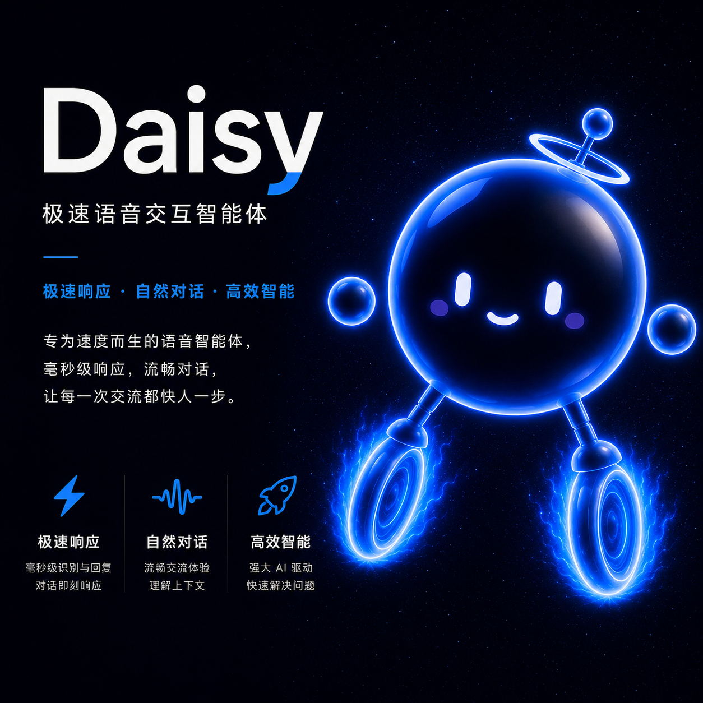

<p align="center">
  
</p>

<h1 align="center">Daisy</h1>

<p align="center">
  <strong>为 macOS 而生的语音优先 AI 助手</strong>
</p>

<p align="center">
  <a href="https://github.com/forestai123456/Daisy-Voice-Agent/releases">下载</a> ·
  <a href="#快速开始">快速开始</a> ·
  <a href="#能为你做什么">能力一览</a> ·
  <a href="#隐私与安全">隐私与安全</a>
</p>

<p align="center">
  
  
  
</p>

> 按住快捷键，说完松开。Daisy 把语音识别、AI 理解、系统操作和自然语音播报连成一次流畅的桌面交互。

## Daisy 是什么？

Daisy 是运行在 macOS 菜单栏之外的轻量语音助手：一个始终可调用的悬浮球，负责把一句自然语言变成实际操作或简洁回答。它不依赖固定命令词；你可以像和助手说话一样让它搜索资料、控制电脑、处理日程，或直接完成日常桌面任务。

所有模型与语音服务均由你自行配置。你的 API Key、Token 与个人设置只保存在本机，不会随仓库或安装包分发。

## 能为你做什么？

| 场景 | Daisy 能做的事 |
| --- | --- |
| **自然语音对话** | 按住右侧 `Option` 键说话，松开自动发送；AI 流式生成回答，并由中文 TTS 自然播报。 |
| **应用与窗口控制** | 打开、关闭或隐藏应用；发送快捷键；输入文本；调节音量；控制媒体播放；锁屏或息屏。 |
| **站内搜索直达** | 直接打开常用站点的结果页，例如“打开 B 站搜索世界杯”“在夸克搜索 AI 新闻”“打开小宇宙搜索科技播客”。 |
| **效率工具** | 创建与搜索备忘录、提醒事项和日历事件；查询天气、地图、时间、赛事；读写剪贴板。 |
| **文件与内容处理** | 在授权范围内读取、创建、整理文件；处理文档与 PDF；下载公开视频或音频；搜索高清壁纸。 |
| **本地状态反馈** | 悬浮球清晰展示聆听、思考、播报和空闲状态，减少“它到底有没有听到”的不确定感。 |

### 你可以这样说

```text
打开 B 站搜索 Daisy 教程
把音量调低一点
明天上午十点提醒我给客户回电话
北京明天的天气怎么样
打开视频号
把我刚复制的图片保存到桌面
```

其中，常见网站的“打开 / 在 ×× 搜索 ××”由本地规则直接路由，不必等待模型判断。当前覆盖内容社区、视频、短剧、小说、播客、财经、医疗、论文、招聘、出行、汽车、购物与开发者社区等常用服务。

## 交互体验

### 一按即说

默认按住右侧 `Option` 键开始说话，松开后 Daisy 自动结束录音、提交识别结果并开始处理。也可在设置中开启“嘿 Daisy”唤醒词。

### 快速反馈，而不是黑箱等待

悬浮球会即时反馈当前阶段：聆听、思考、执行操作、语音播报或空闲。需要安静看结果时，可点击悬浮球中断当前播报。

### 让网页搜索回到正确的网站

“打开抖音搜索世界杯”不会退化为普通浏览器搜索；Daisy 会直接进入目标服务的站内搜索。对没有独立 macOS 应用的网站，例如视频号、红果短剧或夸克，Daisy 会直接打开其网页入口。

## 快速开始

### 1. 安装

在 [Releases](https://github.com/forestai123456/Daisy-Voice-Agent/releases) 下载最新的 `Daisy-*.dmg`，打开后将 **Daisy** 拖入“应用程序”文件夹。

当前发布包使用 ad-hoc 签名，未进行 Apple 公证。首次运行若被 macOS 拦截：在“应用程序”中按住 `Control` 点击 Daisy，选择“打开”，再在确认框中点击“打开”；必要时可前往“系统设置 → 隐私与安全性”选择“仍要打开”。请只从本仓库的 Release 页面获取安装包。

### 2. 配置服务

首次打开 Daisy，在设置界面填入你自己的服务凭据：

1. **AI 对话模型**：DeepSeek 或兼容 OpenAI 接口的模型配置；
2. **语音识别**：火山引擎 / 豆包 ASR 的 App ID 与 Access Token；
3. **语音播报**：默认使用 Microsoft Edge TTS，可在设置中调整；
4. **可选唤醒词**：使用“嘿 Daisy”时，按提示配置本地 `whisper.cpp` 模型文件。

### 3. 授权 macOS 权限

按系统提示授予 Daisy 必要权限：

- 麦克风：采集语音；
- 辅助功能与输入监控：控制应用、发送快捷键和输入文本；
- 自动化相关权限：在你明确要求时操作备忘录、日历、提醒事项等系统应用。

## 从源码运行

环境要求：macOS、Apple Silicon、Node.js 22 或更新版本，以及 npm。

```bash
git clone https://github.com/forestai123456/Daisy-Voice-Agent.git
cd Daisy-Voice-Agent
npm install
cp .env.example daisy.env
# 编辑 daisy.env，填入你自己的密钥；请勿提交该文件
npm run dev
```

构建 DMG：

```bash
npm run dist:mac
```

产物会生成在 `releases/`。`daisy.env` 已被 Git 忽略，并明确排除在安装包之外。

## 项目结构

```text
src/
├── main/       # 语音会话、ASR、TTS、工具执行、快捷键与 macOS 控制
├── preload/    # 主进程与渲染进程之间的受控通信层
└── renderer/   # 悬浮球、音频采集与设置界面
assets/         # 应用图标、本地工具与运行时资源
```

## 功能范围

本仓库聚焦于基础的 macOS 语音助手体验：语音交互、系统控制、工具调用与本地站内搜索。屏幕视觉理解、持续长对话与独立文本展示面板不在此仓库的功能范围内。

## 隐私与安全

- 仓库与 Release 包不包含开发者的 API Key、Access Token 或个人配置；
- 请勿提交或分享自己的 `daisy.env`、日志和截图，其中可能包含敏感信息；
- Daisy 可以按你的要求控制系统、访问文件或运行命令。请仅在可信设备上使用，并谨慎确认涉及文件删除、外发信息或终端命令的请求；
- 这是一个面向个人桌面的工具，请自行评估所配置模型与第三方服务的隐私政策。

## 贡献

欢迎提交 Issue 与 Pull Request。提交前请确认：不包含密钥、Token、个人日志、私有文件路径或截图中的隐私数据。

## 许可证

本项目采用 [MIT License](LICENSE) 发布。Electron、whisper.cpp、yt-dlp 及其他第三方组件仍适用其各自的许可证。
